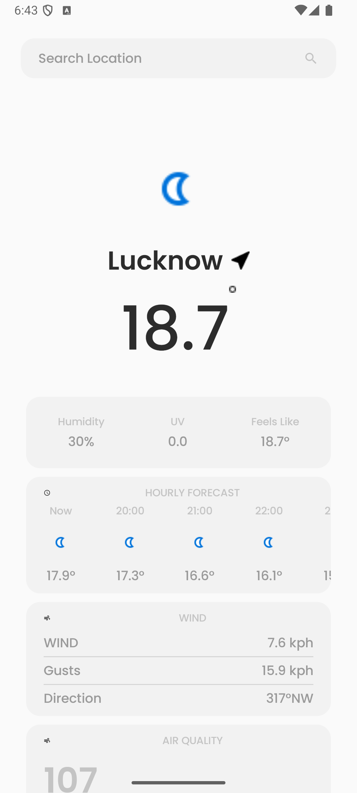

# Weather App - Jetpack Compose Project

This project is developed to showcase my abilities in **Jetpack Compose**, provided by **Nooro**. It implements various Compose UI components, integrates APIs for weather data, and supports navigation. The app allows users to search for weather information based on cities, showcasing a dynamic and responsive UI.

## Features

- **Search for weather**: Search for a city to get its current weather information.
- **Search History**: Ssearched history feature by efficiently storing and managing data in the Room database.
- **Weather data**: Displays current weather data such as temperature, humidity, UV index, feels-like temperature, and more.
- **City Selection**: Users can save a preferred city to get automatic weather updates when the app is opened.
- **UI Components**: Built with Jetpack Compose, using modern UI elements like `Row`, `Column`, `Box`, `Text`, `AsyncImage`, etc.
- **State management**: Handles app states like loading, success, and error gracefully using a sealed class (`Resources`).
- **Navigation**: Implements simple navigation between screens using `NavController`.
- **Edge-to-Edge Design**: The UI is optimized for modern screens, supporting full-screen experiences using FIGMA.

## Technologies Used

- **Jetpack Compose**: For building the UI using declarative UI components.
- **Weather API**: Used for fetching real-time weather data.
- **Hilt**: For dependency injection to manage the app's dependencies.
- **Room Database**: For storing weather data locally.
- **Retrofit**: For API calls to fetch weather data.
- **Kotlin Coroutines**: For asynchronous tasks and handling background operations.
- **DataStore**: For storing the user's selected city locally.
- **ViewModel & StateFlow**: For managing UI-related data in a lifecycle-conscious manner.
- **Material Design Components**: Used for styling and building interactive UI elements.

## Screenshots

- **Splash Screen**: Displays splash screen for androdi 13 users only by default.
  

- **Home Screen**: Displays blank page when nocity is selected.
   
   
  
- **Home Screen**: Displays current weather info for the selected city.
  
  
  - **Home Screen**: Displays current weather info for the selected city a;ong with details data.
  

  - **Search Screen**: Allows users to search and view weather details for a specific city.
  
  
    - **Search Screen**: Allows users to search and view weather details for a specific city along with searched history.
  

- **Search Screen**: when incorrect city was searched.
  
  

## Setup Instructions
### Prerequisites
- Android Studio installed.
- Java 17 or later.
- Gradle configured (build.gradle files).
  
### Steps to Run
- Clone the repository:
```bash
git clone https://github.com/yourusername/weather-app.git
```
- Open the project in Android Studio.
- Sync Gradle: Click on Sync Now to sync Gradle dependencies.
- Run the project on an Android emulator or device.


## App Structure
  ### 1. **Home Screen**
  - Displays the weather of the saved city.
  - Shows weather details like temperature, feels-like temperature, humidity, and UV index.
  - Displays an error message when no city is selected or when data fails to load.

 ### 2. **SearchScreen**
- Users can search for cities and view their weather data.
- Displays weather data like temperature, City Name and weather icon.
- Allows users to navigate back to the HomeScreen when click on city card.
  
 ### 3. **Weather Repository**
- Handles network requests and data caching (if required).
- Fetches weather data from WeatherAPI.

 ### 4. **Weather API Service**
- The service used for making API requests to get current weather data using Retrofit.
  
 ### 5. **Hilt Dependency Injection**
- All dependencies are injected using Hilt to provide a clean architecture.
- WeatherRepository, WeatherApiService, and other components are injected into the ViewModel.
  
 ### 6. **State Management**
- The app uses StateFlow to handle different states of the weather data (Loading, Success, Error).

  ## Dependencies

- **Hilt**: Dependency injection framework.
- **Room**: Storing data.
- **Jetpack Compose**: UI framework.
- **Retrofit**: Networking library for API calls.
- **Coroutines**: For background threading.
- **Gson**: For JSON parsing.

  ## Architecture
  This project follows a clean architecture approach where:

- **UI layer**: Built using Jetpack Compose and reactive UI principles.
- **ViewModel**: Uses StateFlow to manage UI state.
- **Repository**: Handles the business logic and API calls.
- **Dependency Injection**: Hilt is used for easy management of dependencies.

## UI Structure
The UI is designed using Jetpack Compose, making it flexible and easy to maintain.

- **HomeScreen**: Displays weather data for the saved city.
- **SearchScreen**: A screen to search for a new city and view weather information.
- **WeatherIconWithTemperature**: Displays weather information in a compact format.
  
## UI Testing
UI tests are located inside the test directory. These tests ensure that the UI components render correctly, handle user interactions properly, and display weather data as expected.

### Test Cases

#### 1.**Search Bar Test**:

- Verify that the search bar is displayed correctly.
- Ensure that typing into the search bar triggers the weather loading action.
- Check if the search action is triggered when the search icon is clicked.
  
#### 2.**Weather Display Test**:

- Verify that weather data (temperature, humidity, city name) is displayed correctly when fetched from the API.
- Ensure that the error state is displayed when no city is selected or if the API fails.
  
#### 3.**Loading State Test**:

- Ensure that the loading indicator is displayed while fetching weather data.
  
#### 4.**Navigation Test**:

Verify that clicking on a city in the search results takes the user back to the home screen and displays the correct weather data.
